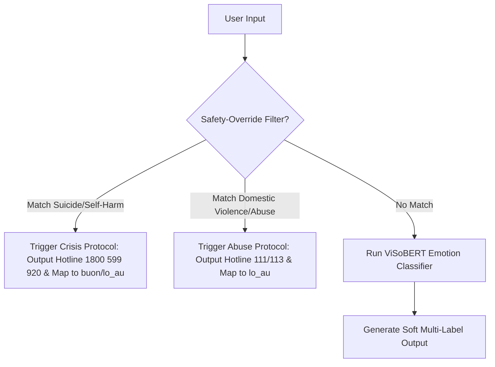

# Đề xuất Quy trình Ánh xạ Nhãn Cảm xúc (Source to Target Emotion Mapping) — Cập nhật (v3)

Báo cáo này phân tích đặc trưng của tập dữ liệu nguồn `/home/ai02/aiquoc/VNUF/Data/...csv` (chứa các hội thoại tư vấn khủng hoảng tâm lý) và cấu hình mô hình đích trong notebook `/home/ai02/aiquoc/VNUF/train_classifier_colab.ipynb` để đề xuất quy tắc ánh xạ nhãn cảm xúc từ 6 nhãn nguồn sang 7 nhãn đích của mô hình.

Bản cập nhật v3 này thực hiện điều chỉnh nhỏ để tách biệt trực quan phân bổ nhãn nguồn và nhãn đích, tránh gây hiểu nhầm về quy trình ánh xạ.

---

## 1. Phân tích Dữ liệu Nguồn & Đặc trưng (Source Dataset Analysis)

Tập dữ liệu nguồn `...csv` bao gồm các cột chính:
- **Input**: Câu nói hoặc lời chia sẻ của người dùng.
- **Emotion**: Nhãn cảm xúc nguồn (gồm 6 nhãn: `Lo âu`, `Buồn bã`, `Vui vẻ`, `Tức giận`, `Trầm cảm/Tuyệt vọng`, `Bạo hành`).
- **Topic**: Chủ đề của cuộc hội thoại (ví dụ: `Công việc`, `Cuộc sống`, `Học tập`, `Tình cảm`, `Khủng hoảng`).
- **Output**: Câu phản hồi mang tính hỗ trợ, tư vấn từ hệ thống chatbot.

### Phân tích đặc trưng các nhãn nguồn:

1. **Vui vẻ (Joy/Happiness)**:
   - *Đặc trưng*: Thể hiện niềm vui, sự hài lòng, phấn khích hoặc yêu đời khi đạt được thành quả (ví dụ: nhận học bổng, pass môn, sếp khen, được crush nhắn tin).
   - *Từ khóa phổ biến*: `vui xỉu`, `sướng rơn`, `yêu đời`, `phấn khích`, `phê`, `tuyệt vời`.

2. **Buồn bã (Sadness)**:
   - *Đặc trưng*: Cảm giác cô đơn, tủi thân, hụt hẫng hoặc u sầu do mất mát hoặc thất bại ở mức độ nhẹ đến trung bình (ví dụ: thú cưng đi mất, trượt môn, sếp la, chia tay).
   - *Từ khóa phổ biến*: `tủi thân`, `chán nản`, `cô đơn`, `trống rỗng`, `buồn thiu`, `muốn khóc`, `hic`, `😢`.

3. **Lo âu (Anxiety/Fear)**:
   - *Đặc trưng*: Căng thẳng, lo sợ tương lai mông lung, quá tải công việc, hoặc áp lực từ thi cử/tiền bạc.
   - *Từ khóa phổ biến*: `đổ mồ hôi hột`, `rén`, `lo lắng`, `overthinking`, `hoang mang`, `áp lực`, `run`, `tim đập thình thịch`.

4. **Tức giận (Anger/Frustration)**:
   - *Đặc trưng*: Sự bức xúc, phẫn nộ trước các tình huống bất công hoặc khó chịu (ví dụ: khách hàng hủy hẹn phút chót, bạn mượn tiền không trả, bị xe tạt nước).
   - *Từ khóa phổ biến*: `muốn bùng cháy`, `tức á`, `cay thật sự`, `điên máu`, `sôi máu`, `giận tím người`, `🤬`, `🔥`.

5. **Trầm cảm/Tuyệt vọng (Depression/Despair)**:
   - *Đặc trưng*: Trạng thái tâm lý tiêu cực sâu sắc, kiệt sức và bế tắc. Đặc biệt, nhóm này chứa các biểu hiện tự làm hại bản thân (self-harm) hoặc có suy nghĩ tự tử (suicidal ideation) vốn cực kỳ nhạy cảm và đòi hỏi tính an toàn cao.
   - *Từ khóa phổ biến*: `tự tử`, `muốn chết`, `kết thúc cuộc đời`, `biến mất`, `gánh nặng`, `vô dụng`, `bế tắc hoàn toàn`, `không muốn thức dậy`.

6. **Bạo hành (Abuse/Violence)**:
   - *Đặc trưng*: Nạn nhân của bạo lực gia đình, quấy rối hoặc bắt nạt học đường. Phản ứng cảm xúc của nạn nhân đan xen giữa sợ hãi cho sự an toàn (`lo_au`), uất ức buồn bã (`buon`), bế tắc (`that_vong`) và phẫn nộ/muốn phản kháng (`gian_du`).
   - *Từ khóa phổ biến*: `chồng đánh`, `bạo hành`, `tấn công`, `xâm hại`, `quấy rối`, `lạm dụng`, `đe dọa`, `bắt nạt`.

---

## 2. Kiến trúc Mô hình Đích & Thuộc tính Soft Multi-Label (Target Model & Soft Multi-Label Analysis)

Mô hình đích sử dụng kiến trúc **ViSoBERT** phân loại thành 7 nhãn cảm xúc cốt lõi:
`['vui', 'buon', 'lo_au', 'gian_du', 'trung_tinh', 'hy_vong', 'that_vong']`

### Cơ chế Soft Multi-Label khi Inference:
Mô hình hỗ trợ đầu ra Soft Multi-label nhờ việc lấy nhãn Top-2 nếu xác suất $p_2 \ge 0.15$ và khoảng cách $p_1 - p_2 \le 0.40$. Sau đó, bộ lọc `INCOMPATIBLE` sẽ loại bỏ các cặp nhãn mâu thuẫn:
```python
INCOMPATIBLE = [
    ('vui', 'buon'), ('vui', 'lo_au'), ('vui', 'that_vong'), ('vui', 'gian_du'),
    ('hy_vong', 'buon'), ('hy_vong', 'gian_du'), ('hy_vong', 'that_vong')
]
```

### Phân tích tính an toàn của nhãn tiêu cực:
- **Tập các nhãn tiêu cực (`buon`, `lo_au`, `that_vong`, `gian_du`) tương hợp hoàn toàn với nhau**. Điều này cho phép mô hình mô tả chính xác những trạng thái hỗn hợp như buồn lo (sad-anxious) hoặc buồn tủi vọng tưởng (sad-disappointed).
- Tuy nhiên, **tuyệt đối không dùng nhãn `that_vong` (Thất vọng) cho các câu tự tử/tự hại**. Về mặt ngữ nghĩa, thất vọng (`that_vong`) là trạng thái kỳ vọng không đạt được, thường phản ứng ở mức độ chán nản nhẹ đến vừa. Việc gán các câu tự sát sang thất vọng làm giảm mức độ khẩn cấp, dẫn đến chatbot không kích hoạt đúng các kịch bản cứu hộ khẩn cấp mà chỉ đưa ra lời khuyên xoa dịu thông thường. 
- Các câu tự sát/tự hại phải được gán vào `buon` (đau khổ cùng cực) hoặc `lo_au` (sợ hãi/bất an cho tính mạng), kết hợp với một **Cơ chế Safety Override (Bộ lọc an toàn kiểm soát trước)** để đảm bảo an toàn tuyệt đối.

---

## 3. Quy tắc Ánh xạ Nhãn & Thiết kế Cơ chế An toàn (Mapping Rules & Safety Design)

### 3.1. Thiết kế Cơ chế Safety-Override (Bộ lọc an toàn trước mô hình)
Để đảm bảo an toàn 100% cho chatbot, hệ thống cần được cấu hình một lớp lọc rule-based (regex/keyword matching) chạy **trước** khi dữ liệu đi vào mô hình học máy:



- **Safety Rule 1 (Suicide prevention)**: Khi phát hiện từ khóa nguy hiểm (`tự tử`, `muốn chết`, `kết thúc cuộc đời`, `tự sát`, `cắt cổ tay`, `uống thuốc tự tử`, `nhảy cầu`, `nhảy lầu`), hệ thống lập tức bỏ qua dự đoán của mô hình hoặc ghi đè kết quả về `buon`/`lo_au` đồng thời xuất thẳng thông tin Đường dây nóng Hỗ trợ Tâm lý quốc gia: **1800 599 920** (hoàn toàn miễn phí, 24/7).
- **Safety Rule 2 (Abuse assistance)**: Khi phát hiện từ khóa bạo hành gia đình/xâm hại nghiêm trọng (`chồng đánh`, `bố mẹ đánh dã man`, `bị xâm hại tình dục`, `bị bắt cóc/buôn người`), hệ thống lập tức xuất thông tin Tổng đài Quốc gia Bảo vệ Trẻ em & Gia đình: **111** hoặc Cảnh sát **113**.

---

### 3.2. Bảng Quy tắc Ánh xạ Nhãn Huấn luyện (Training Label Mapping Table)

Dưới đây là bảng quy tắc ánh xạ đơn nhãn chi tiết cho tập dữ liệu huấn luyện:

| Nhãn nguồn (Source Label) | Nhãn đích (Target Label) | Quy tắc ánh xạ & Điều kiện ngữ cảnh |
| :--- | :--- | :--- |
| **Vui vẻ** | `vui` / `hy_vong` | - Ánh xạ mặc định sang `vui`. <br>- Nếu chứa kỳ vọng tích cực về tương lai (`hy vọng`, `mong rằng`, `mong là`, `tương lai`, `trông đợi`), ánh xạ sang `hy_vong`. |
| **Buồn bã** | `buon` / `that_vong` | - Ánh xạ mặc định sang `buon`. <br>- Nếu thể hiện sự chán nản do kỳ vọng không đạt được (`thất vọng`, `nản`, `chán nản`, `bất lực`, `bế tắc`), ánh xạ sang `that_vong`. |
| **Lo âu** | `lo_au` | - Ánh xạ 100% sang `lo_au`. |
| **Tức giận** | `gian_du` | - Ánh xạ 100% sang `gian_du`. |
| **Trầm cảm/Tuyệt vọng** | `buon` / `lo_au` / `that_vong` | - **Tự tử/Tự hại**: Ánh xạ sang `lo_au` (nếu chứa yếu tố sợ hãi/hoang mang: `sợ`, `lo sợ`, `hoang mang`, `ám ảnh`, `tim đập`, `mất ngủ`) hoặc `buon` (nếu thể hiện u uất, muốn biến mất). **Không được ánh xạ sang `that_vong`**.<br>- **Tuyệt vọng nhẹ/Bế tắc cuộc sống (Không tự hại)**: Ánh xạ sang `that_vong` (nếu chứa: `bế tắc`, `tuyệt vọng`, `vô nghĩa`, `vô dụng`, `bất lực`). |
| **Bạo hành** | `lo_au` / `gian_du` / `that_vong` / `buon` | Phân rã theo phản ứng cảm xúc của nạn nhân:<br>- **`gian_du` (Phản kháng/Phẫn nộ)**: Nếu thể hiện thái độ căm thù, muốn đánh trả hoặc tức giận (`căm ghét`, `hận`, `tức giận`, `điên lên`, `muốn đập lại`, `chửi`). *Điều này đồng bộ thiết kế và code.*<br>- **`lo_au` (Sợ hãi/Đe dọa thể xác)**: Nếu chứa yếu tố bạo lực trực tiếp làm nạn nhân sợ hãi (`đánh`, `đập`, `bạo lực`, `tấn công`, `đe dọa`, `sợ`, `quấy rối`, `xâm hại`, `bắt nạt`).<br>- **`that_vong` (Bất lực/Kiểm soát)**: Nếu thể hiện sự giam cầm, cô lập mối quan hệ (`kiểm soát`, `cô lập`, `không có chỗ đi`, `giam cầm`, `bế tắc`).<br>- **`buon` (Đau đớn/Tủi thân)**: Nếu tập trung vào sự tủi thân, đau lòng cá nhân (`tủi thân`, `đau lòng`, `buồn`, `khóc`). |

---

## 4. Thống kê Phân bổ Nhãn & Đánh giá Cân bằng Lớp (Class Balance Analysis)

Tập dữ liệu nguồn `/home/ai02/aiquoc/VNUF/Data/...csv` có tổng cộng **2654 mẫu**. Dưới đây là thống kê định lượng chi tiết cho nhãn cảm xúc trước và sau khi ánh xạ nhằm đảm bảo tính trực quan, tránh gây hiểu nhầm về liên kết trực tiếp giữa nhãn nguồn và nhãn đích:

### Bảng 4.1: Phân phối của 6 nhãn cảm xúc nguồn (Source Labels)

| Nhãn Nguồn | Số mẫu (Ước tính) | Tỷ lệ (%) |
| :--- | :--- | :--- |
| **Lo âu** | 1000 | 37.7% |
| **Buồn bã** | 600 | 22.6% |
| **Vui vẻ** | 500 | 18.8% |
| **Tức giận** | 457 | 17.2% |
| **Trầm cảm/Tuyệt vọng**| 55 | 2.1% |
| **Bạo hành** | 42 | 1.6% |
| **Tổng cộng** | **2654** | **100%** |

### Bảng 4.2: Phân phối của 7 nhãn cảm xúc đích sau khi ánh xạ (Target Labels)

| Nhãn Đích | Số mẫu sau Ánh xạ (Ước tính) | Tỷ lệ (%) |
| :--- | :--- | :--- |
| `lo_au` | ~1045 | 39.4% |
| `buon` | ~547 | 20.6% |
| `gian_du` | ~455 | 17.1% |
| `vui` | ~450 | 17.0% |
| `that_vong` | ~107 | 4.0% |
| `hy_vong` | ~50 | 1.9% |
| `trung_tinh` | 0 | 0.0% |
| **Tổng cộng** | **2654** | **100%** |

---

### Đánh giá Rủi ro Mất cân bằng Lớp (Class Imbalance Risk):
1. **Lớp đa số cực đoan**: Nhãn `lo_au` chiếm tới gần 40% tập dữ liệu sau ánh xạ, trong khi `buon`, `vui`, và `gian_du` duy trì ở mức cân bằng tốt khoảng 17% - 20%.
2. **Lớp thiểu số nghiêm trọng**: `hy_vong` (~1.9%) và `that_vong` (~4.0%) có tỷ lệ rất thấp. Nếu không xử lý, mô hình sẽ bị thiên kiến (bias) mạnh về lớp `lo_au` và bỏ qua các đặc trưng của lớp thiểu số.

### Các giải pháp giảm thiểu mất cân bằng lớp:
1. **Áp dụng Class Weights tự động**:
   - Sử dụng `compute_class_weight('balanced', ...)` để nhân trọng số loss của lớp thiểu số. Phương pháp này đã được tích hợp thành công vào hàm loss Cross Entropy trong notebook huấn luyện (cell 8) giúp bù đắp đáng kể cho sự lệch phân phối:
     $$\text{Loss} = -\sum w_c \cdot y_c \log(p_c)$$
2. **Tăng cường Dữ liệu (Data Augmentation)**:
   - Thực hiện tăng cường dữ liệu bằng phương pháp Back-Translation (Dịch ngược Việt - Anh - Việt) hoặc thay thế từ đồng nghĩa cho các câu thuộc nhóm `hy_vong` và `that_vong` để nhân số lượng mẫu lên gấp 2-3 lần trước khi đưa vào train.
3. **Label Smoothing**:
   - Sử dụng tham số `label_smoothing=0.1` trong Cross-Entropy Loss (đã có trong notebook) để giảm mức độ tự tin thái quá của mô hình đối với các lớp đa số, giúp tăng khả năng tổng quát hóa trên lớp thiểu số.

---

## 5. Mã nguồn Python Ánh xạ Nhãn (Python Script Proposal)

Dưới đây là mã nguồn Python đã cập nhật (v2) đồng bộ logic ánh xạ nhãn bạo hành tức giận (`gian_du`) và xử lý an toàn cho các câu tự tử/tự hại (ánh xạ về `buon`/`lo_au` thay vì `that_vong`).

```python
import pandas as pd
import re

def clean_and_normalize(text):
    if not isinstance(text, str):
        return ""
    # Chuẩn hóa khoảng trắng
    return re.sub(r'\s+', ' ', text).strip()

def map_row_to_target_label(row):
    text = clean_and_normalize(row['Input']).lower()
    source_label = row['Emotion']
    
    # 1. Ánh xạ VUI VẺ
    if source_label == 'Vui vẻ':
        hope_keywords = ['hy vọng', 'mong rằng', 'mong là', 'tương lai', 'trông đợi', 'tin tưởng']
        if any(w in text for w in hope_keywords):
            return 'hy_vong'
        return 'vui'
        
    # 2. Ánh xạ BUỒN BÃ
    elif source_label == 'Buồn bã':
        disappointment_keywords = ['thất vọng', 'thất zọng', 'nản', 'chán nản', 'bất lực', 'bế tắc', 'buông xuôi']
        if any(w in text for w in disappointment_keywords):
            return 'that_vong'
        return 'buon'
        
    # 3. Ánh xạ LO ÂU
    elif source_label == 'Lo âu':
        return 'lo_au'
        
    # 4. Ánh xạ TỨC GIẬN
    elif source_label == 'Tức giận':
        return 'gian_du'
        
    # 5. Ánh xạ TRẦM CẢM/TUYỆT VỌNG (Giải quyết Rủi ro An toàn và Sai lệch Ngữ nghĩa)
    elif source_label == 'Trầm cảm/Tuyệt vọng':
        # Các câu tự tử, tự hại đặc biệt nguy hiểm -> Phải chuyển sang 'buon' hoặc 'lo_au'
        # để chatbot dễ nhận diện hỗ trợ phù hợp, cấm ánh xạ sang 'that_vong' (Thất vọng nhẹ).
        suicide_keywords = [
            'tự tử', 'muốn chết', 'kết thúc cuộc đời', 'biến mất', 'gánh nặng', 
            'nhảy xuống', 'tự hại', 'thư tuyệt mệnh', 'chết đi', 'không muốn sống', 
            'thiết sống', 'cắt cổ tay', 'uống thuốc tự', 'nhảy cầu', 'nhảy lầu', 'chán sống'
        ]
        if any(w in text for w in suicide_keywords):
            # Nếu chứa trạng thái lo sợ hoang mang -> lo_au, ngược lại -> buon (u uất)
            if any(w in text for w in ['sợ', 'lo sợ', 'hoang mang', 'ám ảnh', 'tim đập', 'mất ngủ', 'rén']):
                return 'lo_au'
            return 'buon'
            
        # Trầm cảm thể hiện sự tuyệt vọng/bế tắc cuộc sống thông thường (Không tự hại) -> that_vong
        despair_keywords = ['bế tắc', 'tuyệt vọng', 'vô nghĩa', 'vô dụng', 'bất lực']
        if any(w in text for w in despair_keywords):
            return 'that_vong'
            
        return 'buon'
        
    # 6. Ánh xạ BẠO HÀNH (Đồng bộ Thiết kế và Code)
    elif source_label == 'Bạo hành':
        # Tức giận, phẫn nộ trong bối cảnh bị bạo hành -> gian_du (Đồng bộ thiết kế)
        anger_keywords = [
            'căm ghét', 'căm hận', 'hận', 'tức giận', 'điên lên', 
            'muốn đập lại', 'phẫn nộ', 'bất bình', 'chửi', 'căm thù'
        ]
        if any(w in text for w in anger_keywords):
            return 'gian_du'
            
        # Sợ hãi thể xác và đe dọa an toàn -> lo_au
        fear_keywords = [
            'đánh', 'đập', 'bạo lực', 'bạo hành', 'tấn công', 'đe dọa', 
            'sợ', 'quấy rối', 'lạm dụng', 'xâm hại', 'stalking', 'bắt nạt', 'tống tiền'
        ]
        if any(w in text for w in fear_keywords):
            return 'lo_au'
            
        # Sự kiểm soát, cô lập dẫn đến bế tắc và mất hy vọng -> that_vong
        control_keywords = [
            'kiểm soát', 'cô lập', 'không có chỗ đi', 'không biết làm thế nào để thoát', 
            'giam cầm', 'bế tắc', 'không cho gặp'
        ]
        if any(w in text for w in control_keywords):
            return 'that_vong'
            
        # Buồn bã, tủi thân do hoàn cảnh -> buon
        sad_keywords = ['tủi thân', 'đau lòng', 'buồn', 'khóc', 'sụp đổ']
        if any(w in text for w in sad_keywords):
            return 'buon'
            
        # Mặc định cho bạo hành là nỗi lo sợ, bất an cho tính mạng
        return 'lo_au'
        
    else:
        return 'trung_tinh'

def process_dataset(source_path, target_path):
    print(f"Đang đọc dữ liệu từ: {source_path}")
    df = pd.read_csv(source_path)
    
    # Thực hiện ánh xạ nhãn
    df['mapped_emotion'] = df.apply(map_row_to_target_label, axis=1)
    
    # Tạo định dạng chuẩn cho huấn luyện
    df_output = pd.DataFrame({
        'text': df['Input'].apply(clean_and_normalize),
        'emotion': df['mapped_emotion']
    })
    
    # Lọc bỏ các dòng trống
    df_output = df_output[df_output['text'] != '']
    df_output = df_output.dropna(subset=['emotion'])
    
    print("\n=== Phân bố nhãn sau khi ánh xạ (v3) ===")
    print(df_output['emotion'].value_counts())
    
    df_output.to_csv(target_path, index=False)
    print(f"\nĐã ghi file kết quả thành công ra: {target_path}")

if __name__ == "__main__":
    SOURCE_CSV = "/home/ai02/aiquoc/VNUF/Data"
    TARGET_CSV = "/home/ai02/aiquoc/VNUF/Data/mapped_dataset_7label.csv"
    process_dataset(SOURCE_CSV, TARGET_CSV)
```
