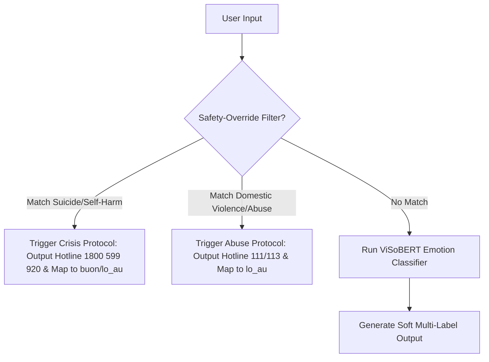

# 3. Quy tắc Ánh xạ Nhãn & Thiết kế Cơ chế An toàn (Mapping Rules & Safety Design)

### 3.1. Thiết kế Cơ chế Safety-Override (Bộ lọc an toàn trước mô hình)
Để đảm bảo an toàn 100% cho chatbot, hệ thống cần được cấu hình một lớp lọc rule-based (regex/keyword matching) chạy **trước** khi dữ liệu đi vào mô hình học máy:

- **Safety Rule 1 (Suicide prevention)**: Khi phát hiện từ khóa nguy hiểm (`tự tử`, `muốn chết`, `kết thúc cuộc đời`, `tự sát`, `cắt cổ tay`, `uống thuốc tự`, `nhảy cầu`, `nhảy lầu`), hệ thống lập tức bỏ qua dự đoán của mô hình hoặc ghi đè kết quả về `buon`/`lo_au` đồng thời xuất thẳng thông tin Đường dây nóng Hỗ trợ Tâm lý quốc gia: **1800 599 920** (hoàn toàn miễn phí, 24/7).
- **Safety Rule 2 (Abuse assistance)**: Khi phát hiện từ khóa bạo hành gia đình/xâm hại nghiêm trọng (`chồng đánh`, `bố mẹ đánh dã man`, `bị xâm hại tình dục`, `bị bắt cóc/buôn người`), hệ thống lập tức xuất thông tin Tổng đài Quốc gia Bảo vệ Trẻ em & Gia đình: **111** hoặc Cảnh sát **113**.

---

### 3.2. Bảng Quy tắc Ánh xạ Nhãn Huấn luyện (Training Label Mapping Table)

Dưới đây là bảng quy tắc ánh xạ đơn nhãn chi tiết cho tập dữ liệu huấn luyện:

| Nhãn nguồn (Source Label) | Nhãn đích (Target Label) | Quy tắc ánh xạ & Điều kiện ngữ cảnh |
| :--- | :--- | :--- |
| **Vui vẻ** | `vui` / `hy_vong` | - Ánh xạ mặc định sang `vui`.  - Nếu chứa kỳ vọng tích cực về tương lai (`hy vọng`, `mong rằng`, `mong là`, `tương lai`, `trông đợi`), ánh xạ sang `hy_vong`. |
| **Buồn bã** | `buon` / `that_vong` | - Ánh xạ mặc định sang `buon`.  - Nếu thể hiện sự chán nản do kỳ vọng không đạt được (`thất vọng`, `nản`, `chán nản`, `bất lực`, `bế tắc`), ánh xạ sang `that_vong`. |
| **Lo âu** | `lo_au` | - Ánh xạ 100% sang `lo_au`. |
| **Tức giận** | `gian_du` | - Ánh xạ 100% sang `gian_du`. |
| **Trầm cảm/Tuyệt vọng** | `buon` / `lo_au` / `that_vong` | - **Tự tử/Tự hại**: Ánh xạ sang `lo_au` (nếu chứa yếu tố sợ hãi/hoang mang: `sợ`, `lo sợ`, `hoang mang`, `ám ảnh`, `tim đập`, `mất ngủ`) hoặc `buon` (nếu thể hiện u uất, muốn biến mất). **Không được ánh xạ sang `that_vong`**. - **Tuyệt vọng nhẹ/Bế tắc cuộc sống (Không tự hại)**: Ánh xạ sang `that_vong` (nếu chứa: `bế tắc`, `tuyệt vọng`, `vô nghĩa`, `vô dụng`, `bất lực`). |
| **Bạo hành** | `lo_au` / `gian_du` / `that_vong` / `buon` | Phân rã theo phản ứng cảm xúc của nạn nhân: - **`gian_du` (Phản kháng/Phẫn nộ)**: Nếu thể hiện thái độ căm thù, muốn đánh trả hoặc tức giận (`căm ghét`, `hận`, `tức giận`, `điên lên`, `muốn đập lại`, `chửi`). *Điều này đồng bộ thiết kế và code.* - **`lo_au` (Sợ hãi/Đe dọa thể xác)**: Nếu chứa yếu tố bạo lực trực tiếp làm nạn nhân sợ hãi (`đánh`, `đập`, `bạo lực`, `tấn công`, `đe dọa`, `sợ`, `quấy rối`, `xâm hại`, `bắt nạt`). - **`that_vong` (Bất lực/Kiểm soát)**: Nếu thể hiện sự giam cầm, cô lập mối quan hệ (`kiểm soát`, `cô lập`, `không có chỗ đi`, `giam cầm`, `bế tắc`). - **`buon` (Đau đớn/Tủi thân)**: Nếu tập trung vào sự tủi thân, đau lòng cá nhân (`tủi thân`, `đau lòng`, `buồn`, `khóc`). |
